# Dasherman - A Role-playing Multiplayer Mobile Game with a Novel Controlling System and AI Enemy

This is the overview of "A Role-playing Multiplayer Mobile Game with a Novel Controlling System and AI Enemy", namely Dasherman,  a Computer Science and Engineering Final Year Project of The Hong Kong University of Science and Technology in 2022-2023.

## Abstract

Despite the gaming industry's rapid development, it appears that many modern games have yet introduced new attractions and freshness in their gameplay, which often left gamers frustrated with the lack of content they may enjoy.

The objective of the project is to create a unique mobile game that differs from the existing games in the industry to provide players with an innovative and enjoyable gaming experience. In light of the shortcomings in the existing mobile games, we have developed a real-time multiplayer game that utilizes a novel character controller. We designed the character controller based on ideas taken from the classical chess game, such as movement similar to the chess piece 'rook' on a rectangular grid map playground, in addition to existing role-playing game (RPG) elements such as the actions to attack and to use items. The controller is also customized for the mobile phone with a straightforward user interface (UI) layout and it only requires simple finger gestures to interact with. Additionally, we have implemented two non-player agents with the finite state machine and reinforcement learning approach as a supplementary feature to offer the players challenging artificial intelligence (AI) opponents to fight against and to enhance playability. 

We achieved the objective of putting forth an interesting and well-designed game based on the feedback from our testers. Other than that, the survey result also suggests that the goal of promoting originality is highlighted with our character controller.

## Introduction
  
Short Introduction Video:

<a href = "https://cse.hkust.edu.hk/ug/fyp/posters/gallery/2022-2023/85_TA2_Media.mp4" target = "_blank"> 
	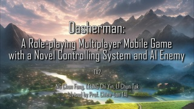
</a>

In this project, we built an RPG to demonstrate our novel character movement controller. The game is divided into different matches between two teams with each having at most five players, e.g., 3 players vs. 3 players or 1 player vs. 5 players. The players are required to think strategically about controlling their characters given the finite resources (HP and EP) in competing against each other, thereby enhancing the technicality and cooperativity of the game. 

We focused on the following objectives:

1. Implement a novel controlling system that is user-friendly and supports strategy-based gameplay. 
2. Implement an AI enemy agent with different levels of ability to challenge the players.
3. Design a UI that avoids blocking the in-game view.
4. Design and implement finger gestures for the different in-game interactions, e.g., using items and casting spells.
5. Provide a multiplayer platform to facilitate both Player versus Player (PvP)  and Player versus Environment (PvE) game modes to meet different players' needs.
6. Design diverse character classes, weapons, items, and skills to enhance playability.

In addition, we provide different game modes and difficulties based on the preferences of both technical players and casual players. Therefore, the game offers two game modes:
1. Player versus Player (PvP) game mode - Players control their characters to compete against real humans. This game mode provides an intense and exciting gameplay as the players compete against each other. The design of the game mode focuses on the character movement, skill system, and item consumption. 
2. Player versus Environment (PvE) game mode - This game mode replaces a team with the AI agents. In other words, the players control their characters to fight against computer-controlled enemies. This game mode provides an enemy agent with two different trained methods, i.e. algorithmic agent and machine learning agent, that players can choose and play against. 

## Methodology

We implemented our game using Unity with C#. We mainly concentrated on designing our character controller, AI enemies, and the multiplayer system.

### 1. Character Controller

Our character class system is an enhancement of the traditional one. Existing systems allow the players to select from multiple types of characters for their appearances such as cosmetics and clothing. Contrarily, our system offers three characters, warrior, mage, and ranger and they are closely related to some in-game attributes, such as EP and recovery rate. In each game, the characters will have a base EP value and EP recovery rate given by their class type. EP determines the distance a character can travel. The further the displacement, the more EP the action consumes. EP recovery rate determines the EP that a character can recover in a second. We hope that the EP system can emphasize critical thinking in the gameplay by bringing in a new dimension of strategic measures such as adopting an aggressive or defensive playstyle, based on the character’s remaining EP to challenge the players to think during the gameplay.

The game is set on a 2-dimensional grid map. A player or an object can only stay in the center of a cell in the grid map (No object can be in two grids or in between grids). Players can only move in four directions (up, down, left, and right). The character’s EP reduces as it moves, and the EP consumption is based on the distance traveled. For instance, if a player moves to the right by 4 grids, it consumes 4 EP. If a character has few EP or even does not have any EP, it can only move for a very short distance or cannot move.

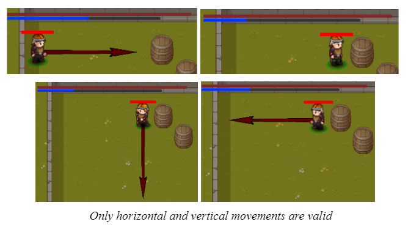

We designed the controller in a simple way while maintaining playability. There are no buttons in our controller and it can be controlled with a single finger only. The controller can invoke three types of actions - Restoring EP, Moving, and Weapon attack. Once the player touches the screen and holds for a few milliseconds, a gamepad shows up which indicates the touching position. If the finger stays at the origin of the gamepad, the in-game character will start restoring EP. Otherwise, the dragged position will determine the destination of the next movement.

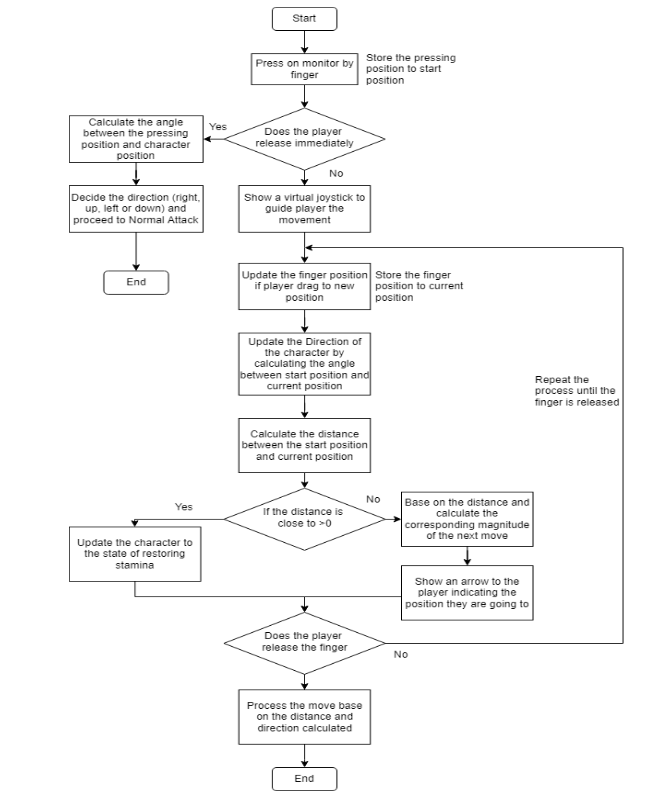

### 2. AI Opponents

We implemented the AI opponent system with two different approaches which are by designing agent algorithms and using machine learning. The implementation details are as follows.

#### A. Algorithmic AI

We implemented the algorithmic agent using the finite state machine approach that has five states which are Idle, Chase, Attack, Respawn, and Died. The logic and actions taken by the agent are fully based on the C# script and the logic flow is shown as follows. The script updates every 0.5 seconds to check the current condition of the agent. Then, based on the agent condition, it changes the state of the agent and performs the corresponding action. If two or more conditions are satisfied simultaneously, the agent follows the priority of Died, Respawn, Attack, Chase, and Idle to select the state.

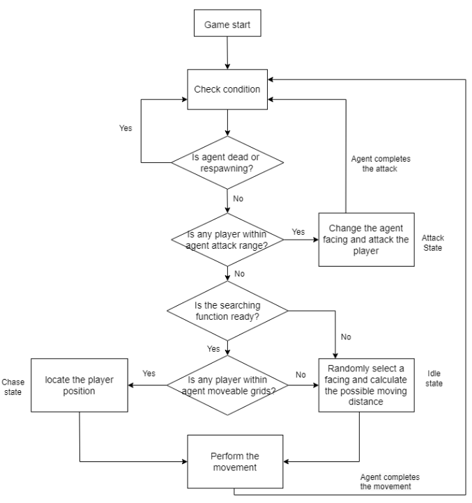
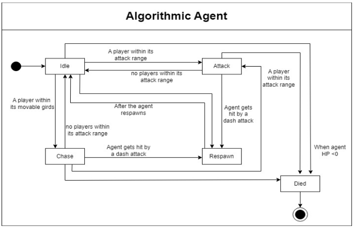

The Range search searches on the 9*9 grid cells (Figure 2.59) centered on the agent’s current position. If more than one player is inside the 9*9 grid cells, the agent will find the closest player. The distance between the agent and the player is calculated using the Manhattan distance, which is the absolute value of the difference between the x and y coordinates of the agent and the player. Then it passes the closest player coordinates to our A* pathfinding algorithm as the destination.

A* algorithm uses the actual cost and the heuristic cost to evaluate the best possible cell it should move to. The cost we set for moving to an adjacent cell (right, up, left, or down) is 1 and the heuristic cost is the Manhattan distance between the current cell we are evaluating and the destination cell. Using Manhattan distance as the heuristic cost prevents the problem of overestimation, and since the heuristic cost is always smaller than the real cost from the current cell to the destination, the optimal path is guaranteed. Once it finds the shortest path, the path will be returned as a list.

The complete path list returned from the A* algorithm needs further path simplification since it contains all the cells starting from the agent's current position to its destination. As the agent is allowed to move more than one cell at a time in the horizontal and vertical direction, we extract all the points that change the moving direction. That is, starting from the second element in the complete path list, we check the two adjacent pairs of points and calculate the difference in the coordinates between those adjacent points and the current checking point. For example, the current checking index is i, it calculates the difference in the coordinates with element index i-1 and i+1. Four values will be obtained (i.e diff_x1, diff_x2, diff_y1, diff_y2). If any of the diff_x1,  diff_x2, diff_y1, and diff_y2 are not equal. It means the current checking point is a turning point in the path and we will store it in a list called “simplify path”. Once it loops through the complete path list and finds all the turning points, the last element in the complete path list will be added to the “simplify path” list as the destination point. 

The “simplify path” list contains the actual point that the agent should move to. The highlighted blue region is all the points stored in the complete path list. The purple points are the turning point and the orange point is the destination point, both are stored in the “simplify path” list. Note that the character with the pumpkin head is the AI agent.

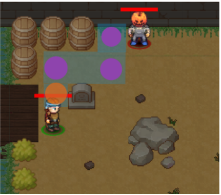

#### B. Machine Learning

To train an AI agent with reinforcement learning, we need to set up the environment, implement the agent structure, and assign a reward signal that the agent will observe upon taking action. Our preliminary approach is to divide the objective into several goals, including attacking and dodging. Similar to a chess game, players should always consider the opponents’ next move before they make a move. They should avoid making a move that could put the opponents in a strong position. In our game, players need to think about attacking while avoiding being attacked. To train such an AI agent that can behave like a human, we first trained an offensive model by having the agent attack a static object (Agent versus static object) and then trained its defensive behavior with the offensive model (Agent versus Agent). We have designed three ways to train the AI - (1) heuristic learning, (2) transfer learning, and (3) imitation learning. Heuristic learning is a method of training the agent by allowing the agent to explore and learn from experience without providing any data. The following is the setting of how we have trained the agent under heuristic learning with the use of the ML-Agents Toolkit.

The objective of the agent is to attack the opponent. We have set up the training environment with a modified version of our PvP mode framework with two entities involved – the AI agent and a dummy opponent as shown. A dummy opponent is used for the AI agent to observe which move will gain a reward. In each episode, we will first initiate the AI agent object and the dummy opponent object in random positions on the map. Each episode will end after 10 seconds if the agent cannot finish the task. After each episode, the two entities will be repositioned and start again. We have also duplicated the environment into multiple instances to enhance the speed of training as shown.

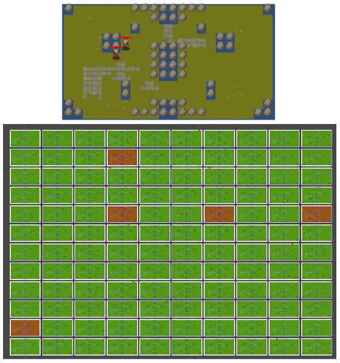

The agent starts with a random action policy, including idling, restoring EP, and moving in a random direction. Each random move reduces a small amount of reward. If the agent successfully attacks the dummy with a dash attack, a reward of 1 point will be added. The agent observes several data as the current state, including its position, HP, EP, and opponent’s (dummy) position. At the end of each episode, the policy is updated with the final score. After millions of training steps, the agent can choose an action that can maximize the score, and equivalently attack the opponent, based on its current state.

A Neural network model is generated by the ML-Agents Toolkit. The input block contains the agent’s current position (x and y coordinates), 4 maximum distances for the 4 directions, the agent’s EP, and the opponents’ current position (x and y coordinates). A total of 17 float values (68 bytes) are observed as the input. In the NN model, there is a total of 17 layers, with 25,610 bytes of total weight to be trained. Finally, it will output the optimal move with two float values (horizontal or vertical move). The architecture is shown.

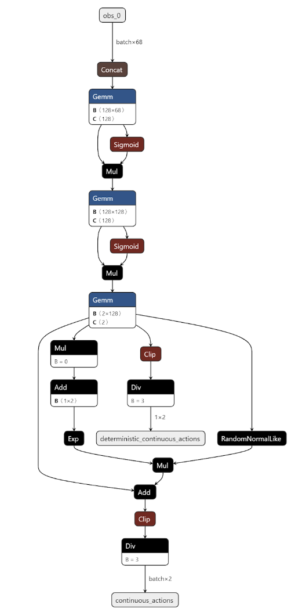

We have trained several models with different hyperparameters under the above environment settings on a map with the same obstacle placement. The high average cumulative reward attained by the best performance model was around 0.7. After training, we tested the models in our actual game environment. The agent can behave well and attack players smoothly on the map. However, it sometimes struggles and moves weirdly.

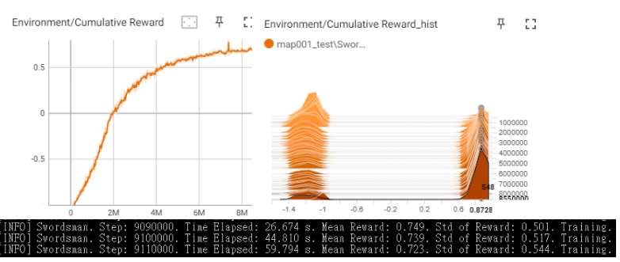

Before deploying our machine learning agent into our actual game for testing by our testers, we evaluated the quality of the agent by playing against it ourselves to measure its behavior. We observed that the agent took many unnecessary steps before attacking, meaning that players could have won before the agent landed a single hit. For example, even if there exists a possible straight path between the player and the agent, the agent would not attack the player directly with a dash attack. Instead, it will make a number of unnecessary moves toward players. In our training, with a successful dash attack as an end, the agent can gain positive rewards with such moves over time. From the human perspective, we consider that behavior irrational. 

Furthermore, after running for a while, the agent started to move toward the wall and did not attempt to attack opponents as we expected. After testing the AI in a few matches, the agent's win rate is 0%. Hence, we do not think it is a competitive and well-performing model that can be deployed.

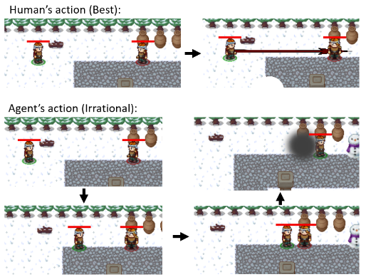

### 3. The Multiplayer System

For the proposed team-based PvP and PvE game modes to be feasible, a multiplayer system is required to be implemented. We decided to use the Photon package to facilitate network communication and the Playfab cloud service to store the player’s data as well as to host the server on the internet so that players can meet each other in the game regardless of their different IP addresses.

#### a. Backend service with Microsoft Azure PlayFab (PlayFab)

Data management is essential for games that require the identification of users. For a multiplayer game such as our project, we used SQL database and the PlayFab cloud service as the database to store player data. We designed a Login scene that requires user authentication before being able to proceed with the application. To simplify the login process, we have saved the user's UID and password into the device once they have registered or log in with an existing account, so players do not need to input their account and password whenever they log in. In all, the login sequence can be visualized in the below diagram.

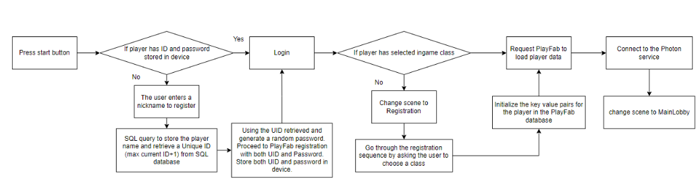

#### b. Backend service with Photon PUN (Photon)

Photon is used to facilitate server-client communication over the network. It eases our development effort by tending to the low-level logic including serialization of data and defining network protocols. Instead, we built some of the key functions using Photon. For example, match-making with the Photon room management module and synchronization with the Photon Raised Event module. The Photon Raised Event module is a method to communicate between game instances. Game instances can send and receive messages by providing an event code, similar to the TV channels where each of them broadcasts a different program. The general case of passing a message can be visualized as follow.

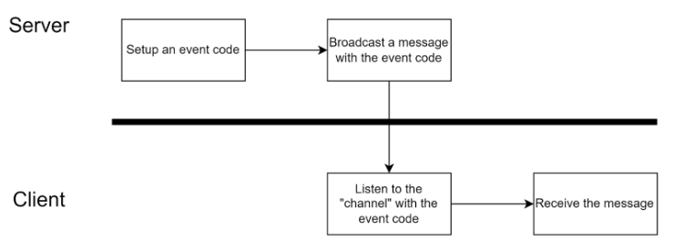
  
## Conclusion

To achieve our goals, we have reviewed various existing games and discussed the key factors contributing to the success of a game. We found out that the attractiveness of a game is not related to how fancy the mechanisms are, but is to the diversity of the gameplay and user-friendliness of the controlling system. Take the classic chess game as an example, a chess board and chess pieces can already entertain people from the 7th century up until the present time. Hence, we have designed a strategy-based role-playing game with a novel controller, which allows the users to control their characters in a grid-based 2D map with simple finger gestures. Moreover, we have implemented two methods of AI agent, the algorithmic agent and the reinforcement learning agent, to challenge the players. In general, from the analysis of our testers' feedback, our project meets most of the goals.

## Project Information

##### Topic Full Name

- A Role-playing Multiplayer Mobile Game with a Novel Controlling System and AI Enemy

##### Group ID
- TA2

##### Supervisor
- Prof. Chiew-Lan TAI

##### Group Members
- LI Chun Tak (https://github.com/a1347539)
- LEUNG Chi Yin (https://github.com/cyleungbj)
- NG Chun Fung (https://github.com/cfngai)
